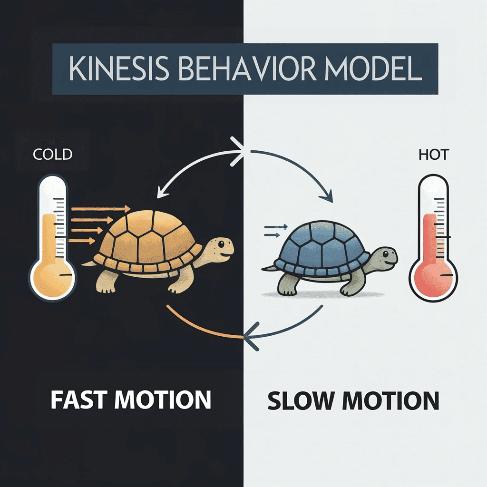
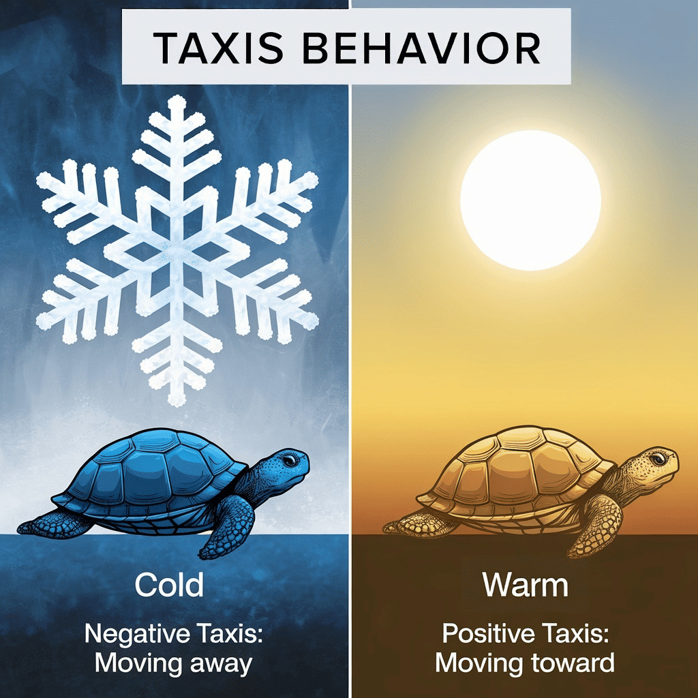
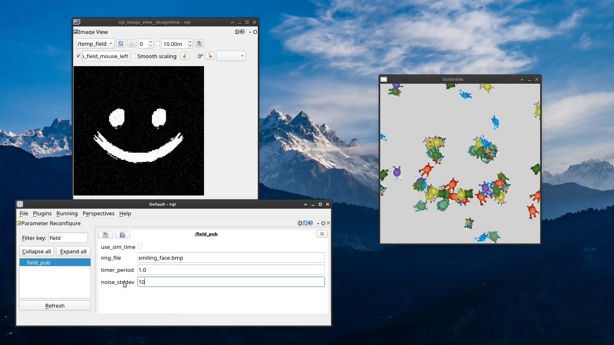
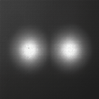

# Thermofilic Turtles

A ROS2 package for simulating turtle behavior in a dynamic temperature field using the `turtlesim` node.

## Overview

This package implements two motion behaviors influenced by temperature:
- **Kinesis:** Variation in movement frequency or rate based on stimulus changes.



- **Taxis:** Directional movement toward or away from a stimulus.



The simulation leverages ROS2 nodes, parameters, and launch configurations to model and visualize the behavior.

## Features

- **Python Implementation:**  
  Developed entirely in Python using standard ROS2 libraries.

- **ROS2 Integration:**  
  Utilizes ROS2 nodes for behavior controllers (e.g. `kinesis_ctrl`) and field data publishing (`field_publisher_node`). The launch file (`start.launch.py`) coordinates node startup and parameter passing.

- **Dynamic Field Simulation:**  
  Processes BMP images to generate a lookup table representing the temperature field. The field publisher node converts the image into a ROS2 `Image` message that drives controller behavior.

- **Visualization:**  
  Uses the `turtlesim` node to display real-time simulation of turtle motion according to the generated field values.

## Prerequisites

- [ROS2](https://index.ros.org/doc/ros2/) (Foxy, Humble, or later)
- [turtlesim](https://index.ros.org/p/turtlesim/) package

## Installation

1. **Clone the repository:**
    ```sh
    git clone https://github.com/lexmaister/thermofilic_turtles
    ```
2. **Build the workspace using colcon:**
    ```sh
    mkdir thermofilic_turtles_ws
    cd thermofilic_turtles_ws
    colcon build --symlink-install
    ```
3. **Source the setup file:**
    ```sh
    source install/local_setup.bash
    ```

## Usage

Launch the simulation after building and sourcing your workspace:
```sh
ros2 launch thermofilic_turtles start.launch.py
```

This command starts the turtlesim node and spawns turtle controller nodes based on the specified simulation type (kinesis or taxis). The turtles will move according to the temperature field generated from the specified BMP image.

The turtlesim window will display the turtles moving in response to the temperature field, with their behavior determined by the selected controller type.

It also available to set up logging level for nodes:
```sh
ros2 launch thermofilic_turtles start.launch.py log_level:=DEBUG
```

After launching the simulation, field parameters can be viewed and adjusted using rqt:
- **Set Field Parameters:**  
  Use the `rqt` interface (e.g. `rqt_gui`) to view and modify field parameters at runtime if supported by your ROS2 parameter configuration.
  
- **Field Image Overview:**  
  Run `rqt_image_view` to subscribe to the `/temp_field` topic and observe the temperature field images generated by the field publisher node:
    ```sh
    ros2 run rqt_image_view rqt_image_view
    ```



## Configuration

The launch file (`start.launch.py`) provides configurable parameters:

- **Turtles Count:**  
  Number of turtle controller nodes to spawn.  
  **Default:** `75`

- **Simulation Type:**  
  Selects the behavior controller, either `"kinesis"` or `"taxis"`.  
  **Default:** `"kinesis"`

- **Turtlesim Background Color:**  
  Sets the background color of the turtlesim window using RGB values.  
  **Default:** `(210, 210, 210)`

- **Field Parameters:**  
  - `img_file`: BMP image file used to generate the temperature field from `/resource` directory.
    **Default:** `"field_1.bmp"`

    
  - `timer_period`: Interval (in seconds) for updating the temperature field.  
    **Default:** `1.0`
  - `noise_stddev`: Standard deviation for noise applied to the field data.  
    **Default:** `5`

- **Movement Parameters:**  
  The linear and angular velocity ranges for each turtle:
  - `linear_vel_min`: Minimum linear velocity.  
    **Default:** `0.1`
  - `linear_vel_max`: Maximum linear velocity.  
    **Default:** `1.0`
  - `angular_vel_min`: Minimum angular velocity.  
    **Default:** `0.1`
  - `angular_vel_max`: Maximum angular velocity. Calculated as `3.14 / 4` (approximately `0.785` rad/s).  
    **Default:** `3.14 / 4`

- **Controller Launch Delay:**  
  Cumulative delay between launching consecutive controller nodes.  
  **Default:** `0.5` seconds

Parameters can be modified directly within `start.launch.py` or overridden using ROS2 parameter mechanisms at runtime.

## License

Licensed under the [MIT LICENSE](LICENSE) file.